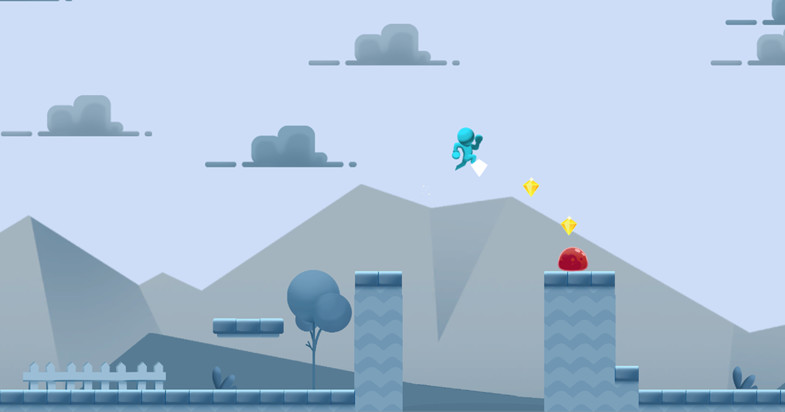

# Micro Games Platform

## Overview
Project made to test some mechanics in a platform 2D using Unity 2018.4.10f1 LTS.
The base asset to do this is in the [asset store](https://assetstore.unity.com/packages/templates/micro-games-platformer-151055).

	

## TODO
* ~~New Enemy~~: Add a new enemy with a diferent behavior.
* ~~Chackpoint~~: Add a checkpoint system, when the player dies the player go back to the last checkpoint.
* ~~Trampoline~~: Add a object in the scene with the function of a trampoline, when the player jumps on, he will be launched up.
* ~~Power-ups spawner~~: Add a spawn system of power-ups. Need to be at least 3 differents power-ups that appear in differents specifics places in the scene.
	* ~~Star~~: the player becomes immortal to the monsters and kills them by touching.
	* ~~Feather~~: Create the ability of double jump.
	* ~~Zero Gravity~~: Decrese the gravity scale.
* extra Mobile Controls: A simple control for mobile, just to the player be able to walk and to jump.
* extra ~~HUD~~: A main menu, loading screen and a place to change the settings (sounds).

## Authors
* **João Vitor Filgueira Albuquerque** - [João Vitor's site](https://jvalbuquerque.com.br)

## Copyrights
* A* pathfinding - [Aron Granberg](https://arongranberg.com/)